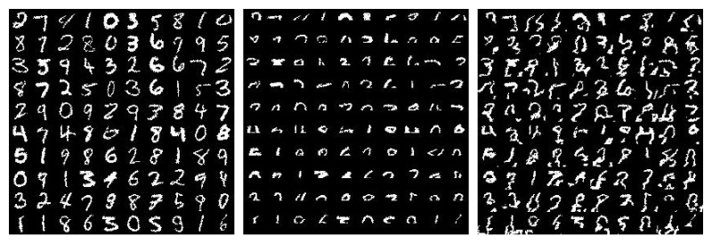

# PixelCNN in TensorFlow

TensorFlow implementation of [Pixel Recurrent Neural Networks](https://arxiv.org/abs/1601.06759) but only PixelCNN.

Samples generated with partial mnist datasets.

But can't generate samples from zeros images very well

## References

- [carpedm20/pixel-rnn-tensorflow](https://github.com/carpedm20/pixel-rnn-tensorflow)